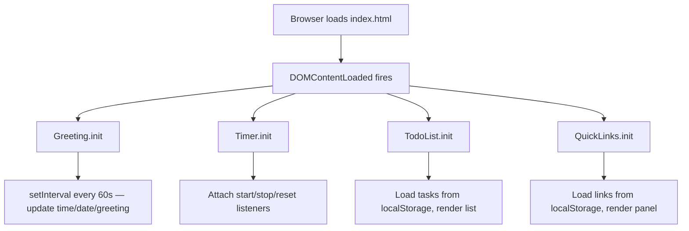
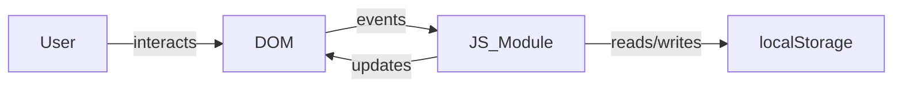

# Design Document

## Overview

A single-page personal dashboard built with vanilla HTML, CSS, and JavaScript — no frameworks, no build tools, no backend. Everything runs in the browser. The four widgets (Greeting, Focus Timer, To-Do List, Quick Links) are self-contained modules that share a single JS file and a single CSS file. Persistent data lives in `localStorage`.

The app is a static file that can be opened directly in a browser (`file://`) or served from any static host.

---

## Architecture

The app follows a **module-per-widget** pattern inside a single `js/app.js` file. Each widget is an IIFE-style object or set of functions grouped by concern. There is no routing, no state management library, and no virtual DOM — just direct DOM manipulation.

```
vanilla-web-app/
├── index.html          # Single HTML page, all widget markup
├── css/
│   └── style.css       # All styles
└── js/
    └── app.js          # All JavaScript, split into widget modules
```

### Execution Flow



### Data Flow



---

## Components and Interfaces

### Greeting Widget

Responsible for displaying time, date, and greeting. Runs a `setInterval` every 60 seconds.

```
Greeting
  init()              — renders immediately, starts interval
  render(date: Date)  — updates #greeting-time, #greeting-date, #greeting-message
  getGreeting(hour: number): string  — pure function, returns greeting string
```

### Focus Timer

Manages a 25-minute countdown. Uses `setInterval` for ticking and clears it on stop/reset.

```
Timer
  init()     — sets initial display, attaches button listeners
  start()    — starts interval, disables start button
  stop()     — clears interval, retains remaining time
  reset()    — clears interval, restores to 1500s, updates display
  tick()     — decrements remaining seconds, updates display, checks for 00:00
  format(seconds: number): string  — pure function, returns "MM:SS"
```

### To-Do List

Manages task CRUD with localStorage persistence.

```
TodoList
  init()                        — loads from storage, renders
  addTask(label: string)        — validates, creates task object, saves, renders
  toggleTask(id: string)        — flips completed flag, saves, renders
  editTask(id: string, label: string)  — validates, updates label, saves, renders
  deleteTask(id: string)        — removes task, saves, renders
  save()                        — writes tasks array to localStorage
  load(): Task[]                — reads and parses tasks from localStorage
  render()                      — rebuilds task list DOM from tasks array
  validate(label: string): boolean  — pure function, returns false for empty/whitespace
```

### Quick Links

Manages link CRUD with localStorage persistence.

```
QuickLinks
  init()                              — loads from storage, renders
  addLink(label: string, url: string) — validates, creates link object, saves, renders
  deleteLink(id: string)              — removes link, saves, renders
  save()                              — writes links array to localStorage
  load(): Link[]                      — reads and parses links from localStorage
  render()                            — rebuilds links panel DOM from links array
  validateUrl(url: string): boolean   — pure function, returns false for invalid URLs
```

---

## Data Models

### Task

```js
{
  id: string,          // crypto.randomUUID() or Date.now().toString()
  label: string,       // non-empty, trimmed
  completed: boolean   // default: false
}
```

Stored in `localStorage` under the key `"tasks"` as a JSON array.

### Link

```js
{
  id: string,   // crypto.randomUUID() or Date.now().toString()
  label: string, // non-empty, trimmed
  url: string    // valid URL (passes URL constructor check)
}
```

Stored in `localStorage` under the key `"links"` as a JSON array.

### localStorage Schema

| Key       | Value                        |
|-----------|------------------------------|
| `"tasks"` | `JSON.stringify(Task[])`     |
| `"links"` | `JSON.stringify(Link[])`     |

---

## Correctness Properties

*A property is a characteristic or behavior that should hold true across all valid executions of a system — essentially, a formal statement about what the system should do. Properties serve as the bridge between human-readable specifications and machine-verifiable correctness guarantees.*

### Property 1: Greeting classification covers all hours

*For any* integer hour in [0, 23], `getGreeting(hour)` SHALL return exactly one of "Good Morning", "Good Afternoon", "Good Evening", or "Good Night", and the result SHALL match the correct time range (Morning: 5–11, Afternoon: 12–17, Evening: 18–21, Night: 22–4).

**Validates: Requirements 1.3, 1.4, 1.5, 1.6**

---

### Property 2: Time display format

*For any* `Date` object, the time-formatting function SHALL return a string matching the pattern `HH:MM` (two-digit hour, colon, two-digit minute).

**Validates: Requirements 1.1**

---

### Property 3: Date display contains required components

*For any* `Date` object, the date-formatting function SHALL return a string that contains a full weekday name, a full month name, a numeric day, and a four-digit year.

**Validates: Requirements 1.2**

---

### Property 4: Timer format produces valid MM:SS strings

*For any* integer number of seconds in [0, 1500], `Timer.format(seconds)` SHALL return a string matching the pattern `MM:SS` where MM and SS are zero-padded two-digit numbers.

**Validates: Requirements 2.3**

---

### Property 5: Timer tick decrements by exactly one second

*For any* remaining time value greater than 0, calling `tick()` SHALL decrease the remaining time by exactly 1 second.

**Validates: Requirements 2.2**

---

### Property 6: Stop preserves remaining time

*For any* timer state with a given remaining time, calling `stop()` SHALL leave the remaining time value unchanged.

**Validates: Requirements 2.4**

---

### Property 7: Task input validation rejects whitespace-only strings

*For any* string composed entirely of whitespace characters (spaces, tabs, newlines, or the empty string), both `addTask()` and `editTask()` SHALL reject the input and leave the task list unchanged.

**Validates: Requirements 3.2, 3.6**

---

### Property 8: Adding a valid task grows the list

*For any* task list and any non-empty, non-whitespace string label, calling `addTask(label)` SHALL result in the task list containing one additional task with that label and `completed = false`.

**Validates: Requirements 3.1**

---

### Property 9: Toggle completion is an involution

*For any* task, calling `toggleTask()` twice SHALL restore the task's `completed` field to its original value (i.e., toggle is its own inverse).

**Validates: Requirements 3.3**

---

### Property 10: Edit updates label for valid input

*For any* task and any non-empty, non-whitespace string, calling `editTask(id, newLabel)` SHALL update the task's label to the trimmed new value.

**Validates: Requirements 3.5**

---

### Property 11: Delete removes the target task

*For any* task list containing a task with a given id, calling `deleteTask(id)` SHALL result in no task with that id remaining in the list, while all other tasks remain unchanged.

**Validates: Requirements 3.7**

---

### Property 12: Task persistence round-trip

*For any* sequence of task mutations (add, edit, delete), the data written to `localStorage["tasks"]` SHALL be deserializable back to an array that is structurally equal to the current in-memory task list, and calling `TodoList.init()` after writing SHALL restore that exact list.

**Validates: Requirements 3.8, 3.9**

---

### Property 13: Link input validation rejects invalid inputs

*For any* combination of missing/empty label or malformed URL (one that fails the `URL` constructor), `addLink()` SHALL reject the input and leave the links panel unchanged.

**Validates: Requirements 4.2**

---

### Property 14: Adding a valid link grows the panel

*For any* links panel and any non-empty label with a valid URL, calling `addLink(label, url)` SHALL result in the panel containing one additional link with that label and URL.

**Validates: Requirements 4.1**

---

### Property 15: Link delete removes the target link

*For any* links panel containing a link with a given id, calling `deleteLink(id)` SHALL result in no link with that id remaining in the panel, while all other links remain unchanged.

**Validates: Requirements 4.4**

---

### Property 16: Link persistence round-trip

*For any* sequence of link mutations (add, delete), the data written to `localStorage["links"]` SHALL be deserializable back to an array structurally equal to the current in-memory links list, and calling `QuickLinks.init()` after writing SHALL restore that exact list.

**Validates: Requirements 4.5, 4.6**

---

## Error Handling

### Input Validation

- Empty or whitespace-only task labels: show an inline validation message near the input field; do not add/update the task.
- Empty link label or invalid URL: show an inline validation message; do not add the link.
- URL validation uses the `URL` constructor — if `new URL(value)` throws, the URL is invalid.

### localStorage Failures

- `localStorage.getItem` returning `null` (first load or cleared storage): treat as empty array, render empty list.
- `JSON.parse` throwing (corrupted data): catch the error, fall back to empty array, log a console warning.
- `localStorage.setItem` throwing (storage quota exceeded): catch the error, log a console warning; the in-memory state remains valid even if persistence fails.

### Timer Edge Cases

- Calling `start()` while already running: the start button is disabled, so this is prevented at the UI level.
- `tick()` reaching 0: clear the interval, display "00:00", fire the notification (alert or `AudioContext` beep).

---

## Testing Strategy

### Approach

This feature uses a **dual testing approach**:

- **Unit / example-based tests** for specific behaviors, edge cases, and UI interactions.
- **Property-based tests** for universal correctness properties (see Correctness Properties section above).

The target language is JavaScript. The recommended property-based testing library is **[fast-check](https://github.com/dubzzz/fast-check)**, which runs in Node.js without a browser and integrates with Jest or Vitest.

### Property-Based Tests

Each correctness property maps to one `fc.assert(fc.property(...))` test configured to run a minimum of **100 iterations**.

Tag format for each test:
```
// Feature: vanilla-web-app, Property N: <property_text>
```

Properties to implement as PBT:

| Property | Function under test | Arbitraries |
|----------|--------------------|----|
| 1 | `getGreeting(hour)` | `fc.integer({min:0, max:23})` |
| 2 | `formatTime(date)` | `fc.date()` |
| 3 | `formatDate(date)` | `fc.date()` |
| 4 | `Timer.format(seconds)` | `fc.integer({min:0, max:1500})` |
| 5 | `Timer.tick()` | `fc.integer({min:1, max:1500})` |
| 6 | `Timer.stop()` | `fc.integer({min:0, max:1500})` |
| 7 | `validate(label)` | `fc.stringOf(fc.constantFrom(' ','\t','\n'))` |
| 8 | `TodoList.addTask()` | `fc.string().filter(s => s.trim().length > 0)` |
| 9 | `TodoList.toggleTask()` | `fc.boolean()` (initial completed state) |
| 10 | `TodoList.editTask()` | `fc.string().filter(s => s.trim().length > 0)` |
| 11 | `TodoList.deleteTask()` | `fc.array(taskArbitrary)` + random index |
| 12 | `TodoList.save()` + `load()` | `fc.array(taskArbitrary)` |
| 13 | `QuickLinks.validateUrl()` | `fc.string()` (malformed URLs) |
| 14 | `QuickLinks.addLink()` | `fc.string().filter(...)` + `fc.webUrl()` |
| 15 | `QuickLinks.deleteLink()` | `fc.array(linkArbitrary)` + random index |
| 16 | `QuickLinks.save()` + `load()` | `fc.array(linkArbitrary)` |

### Unit / Example-Based Tests

- Timer initialises to 1500 seconds and displays "25:00" (Req 2.1)
- Timer reset from any state restores to 1500 and "25:00" (Req 2.5)
- Timer reaching 00:00 fires notification and stops (Req 2.6)
- Start button is disabled while timer is running (Req 2.7)
- Edit control pre-fills input with current task label (Req 3.4)
- Clicking a link calls `window.open(url, "_blank")` (Req 4.3)

### Test Isolation

- `localStorage` is mocked (e.g., using `jest-localstorage-mock` or a simple in-memory stub) so tests do not depend on a real browser environment.
- Timer tests use fake timers (`jest.useFakeTimers()` or Vitest equivalent) to avoid real `setInterval` delays.
- DOM-dependent tests use `jsdom` (provided by Jest/Vitest by default).
